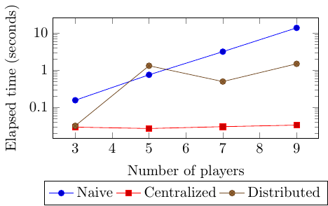
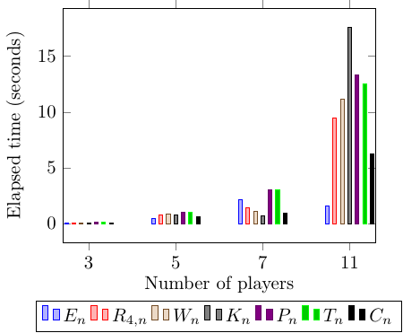
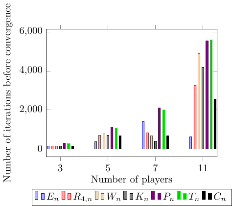

# Efficient distributed solutions for sharing energy resources at local level: a cooperative game approach. 

Repository with the code used for the submission.

## Installation

```bash

sudo apt-get install -y python3-venv parallel awk # Required packages
# Plotting also requires latex, tikz and pgfplots

python3 -m venv venv # Create virtualenv
source venv/bin/activate # Activate virutalenv
python -m pip install -r requirements.txt # Install requeriments
echo $PWD > $(find venv -name site-packages)/thisproject.pth # Add the project folder to PYTHONPATH
```


## How to run

This shows how to run simulations. To types of simulations are defined:
`simple` and `complete`. The `simple` simulation offers a reduced number of
cases, but it is fast, good to get a feeling that everything works as expected.

To run the simulations with the parameters used in the paper, replace `simple`
with `complete` in the following commands.

There are two sets of simulations:

1) Comparing the runtime of the different algorithms.
2) Comparing the runtime of different topologies.

### Comparing algorithms

```bash
source venv/bin/activate # Activate virutalenv
python sim/sim_compare_algorithms.py simple # Simulate the games
python sim/analysis_algorithms.py simple # Create the plot
pushd ~/Out/comp_algs # Move to the directory where the results are created
pdflatex simple_compalg.tex
popd
```

Example output of the execution above:




### Comparing Topologies

```bash
source venv/bin/activate # Activate virutalenv
./run_sim.sh simple # Runs several topologies in parallel, this might take a few minutes
python sim/analysis_comp_graphs.py simple # Create plots
pushd ~/Out/com_graphs
pdflatex simple_comptop.tex
pdflatex simple_niters.tex

```
Example output of the execution above:





